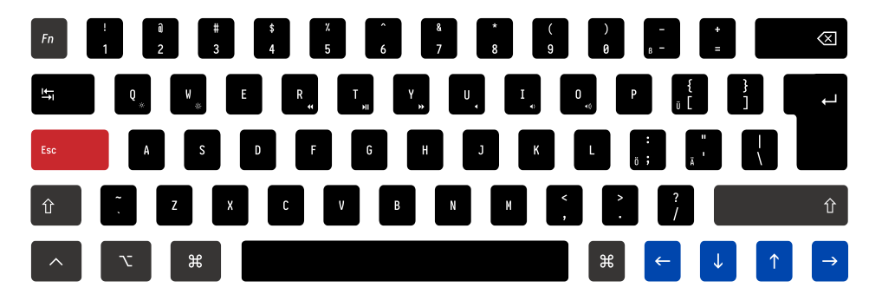

# Custom DZ60 ISO MAC QERTY Layout

60% ISO key layout with customized Mac QUERY layout

Customizations:
- Shift + Backspace = Delete
- Caps Lock = Esc
- top left key (left of 1) = Esc on tap, or Fn on hold
- German umlauts are send as unicode when combined with a specific modifier key
- Vim style arrow keys below the right shift key
- Fn + first row = F1..F12 keys
- Mac style placement of modifier keys (ctrl, option, command)
- Fn + certain buttons in the second row = various media keys



(picture of my custom keycaps order from [wasd](http://www.wasdkeyboards.com))

## Build

```
git submodule update --init --recursive
make build
```

## Flash firmware

```
brew install homebrew/cask-drivers/qmk-toolbox
```

Flash via QMK Toolbox:
- Press reset button on the back to bring keyboard into bootloader mode
- MCU: atmega32u4

## Troubleshooting

- Turn off RGB underglow via Fn+L
- If the Command keys stop working, unplug the keyboard, plug it in again while holding down back space and backspace
